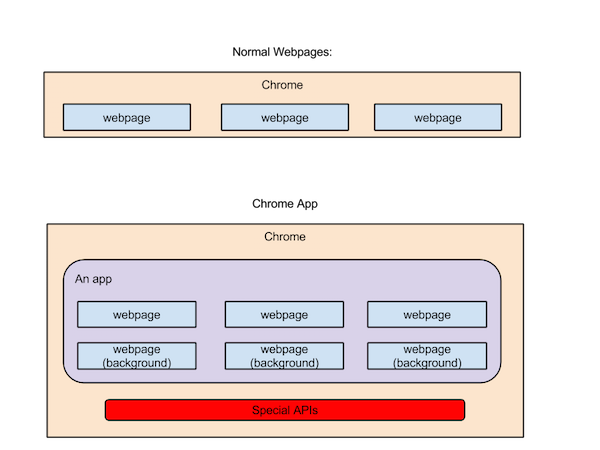

class: center, middle

Chrome App
===========

---

What is it?
----------

--
- normal webpages + Chrome Platform APIs

--


---

Advantages from Chrome Platform APIs
====================================

--
- rich APIs: https://developer.chrome.com/apps/api_index

--
- benefit from lifecycle events
  - install
  - update
  - uninstall
  - restarted

---

Some Demonstrations
===================

--
1. Minimal
  - background page & window page are the same thing

--
2. Cross windows communication

--
3. Storage API
  - chrome.storage.sync
  - chrome.sotrage.local
  - they have ops:
    - .get
    - .set 
    - .remove
    - etc
  - and event:
    - onChanged

---

Tips & Traps
=====

--
- [csp](https://developer.chrome.com/extensions/contentSecurityPolicy) 
  - default: `script-src 'self'; object-src 'self'`

--
    - no inline javascript
```html
<script type="text/javascript">
  // Forbidden!
</script>
```

--
    - no `eval` and `Function`:
```javascript
  // Forbidden!
  eval("var a = 'myval';");
  var b = new Function("return 'myval';");
```

--
    - for some frameworks like AngularJs, you need to use a "safer" mode, in
AngularJS: `<body ng-app="myapp" ng-csp>`

--
- default stylesheet

--
  - scroll & print (DEMO)

---

Other things
===========

- Chrome Apps for Mobile (MCA)
- IDE: Chrome Dev Editor (https://github.com/GoogleChrome/chromedeveditor)
- [nw.js support chorme.* APIs since 0.13.0-alpha0](https://groups.google.com/forum/#!msg/nwjs-general/IqfH1RXNGlw/2PgeRGHO-B4J)
